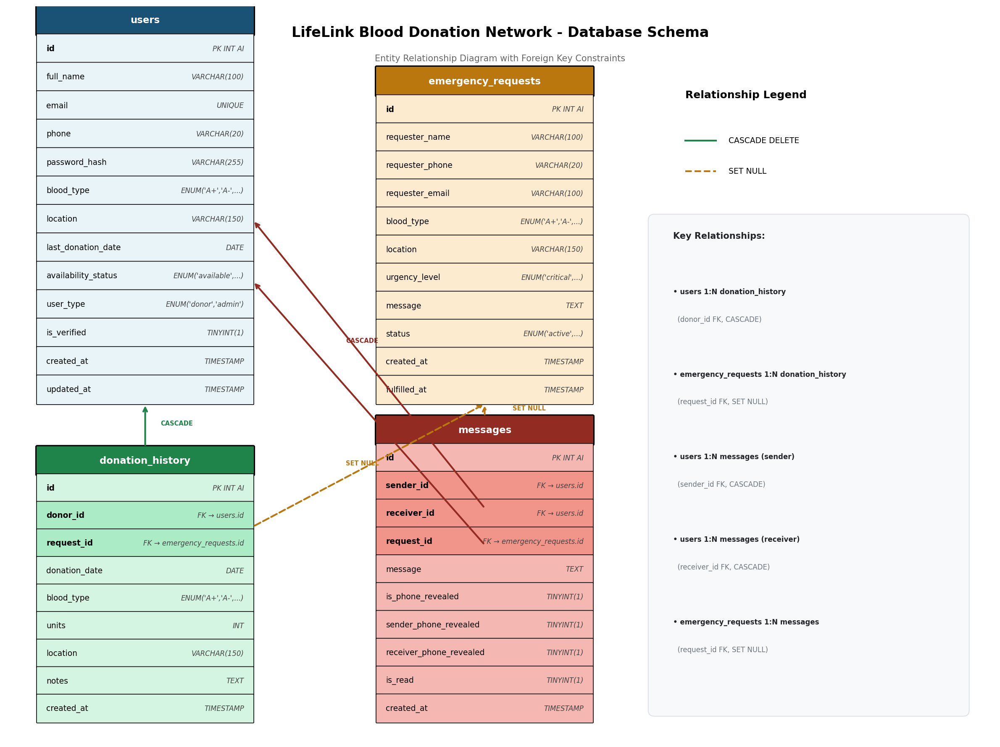

<div align="center">

# 🩸 LifeLink — Blood Donation Network

**Connecting blood donors with patients in need.**

A web-based platform built for the University of Kelaniya community using raw PHP, MySQL, HTML, CSS, and JavaScript — no frameworks.

[](https://github.com/kavix/DropOfHope/actions/workflows/php.yml)
[](LICENSE)


---

**Course:** COSC 31103 / BECS 31233 — Web & Internet Technologies  
**Department:** Department of Statistics & Computer Science  
**University:** University of Kelaniya  
**Academic Year:** 2024/2025

</div>

---

## ✨ Features

| Role | Capabilities |
|------|-------------|
| **Donor** | Register, manage profile, toggle availability, track donation history, check eligibility, receive messages |
| **Patient / Family** | Post emergency requests, search donors by blood type & location, contact donors securely |
| **Admin** | Verify donors, add donation records, manage requests, export CSV, view platform statistics |

**Platform highlights:**
- 🔒 Secure messaging — phone numbers only shared with mutual consent
- 🩸 Eligibility checker — enforces 90-day minimum gap between donations
- 📍 Location-aware donor search
- 📊 Live statistics on the homepage (verified donors, active requests, total donations)
- 📱 Fully responsive design

---

## 🚀 Quick Start

### Prerequisites

- PHP 8.1+
- MySQL 5.7+ (or MariaDB)
- Apache / Nginx with `mod_rewrite` (or XAMPP / MAMP locally)

### Setup

```bash
# 1. Clone the repo
git clone https://github.com/kavix/DropOfHope.git
cd DropOfHope

# 2. Create the database
#    Open phpMyAdmin (or mysql CLI) and run:
mysql -u root -p < database.sql

# 3. (Optional) Configure environment variables
cp .env.example .env
# Edit .env with your DB credentials if they differ from the defaults

# 4. Start a local server
#    Option A — PHP built-in server:
php -S localhost:8000

#    Option B — Place the folder in your XAMPP/MAMP htdocs and start Apache
```

Then open **http://localhost:8000** in your browser.

> [!NOTE]
> By default, `config.php` connects to `localhost` with user `root` and an empty password — the standard XAMPP/MAMP setup. Set `DB_HOST`, `DB_NAME`, `DB_USER`, and `DB_PASS` environment variables (or edit `.env`) to override.

---

## 🔑 Demo Accounts

All demo accounts share the same password: **`password`**

| Role | Email | Password |
|------|-------|----------|
| Admin | admin@lifelink.lk | password |
| Donor (O+) | kasun@email.com | password |
| Donor (A+) | nimali@email.com | password |
| Donor (B+) | sajith@email.com | password |
| Donor (O-) | ruwan@email.com | password |

> [!CAUTION]
> Change these credentials before deploying to a live server.

---

## 📁 Project Structure

```
DropOfHope/
├── index.php                 # Landing page — live stats & recent requests
├── login.php                 # Authentication
├── register.php              # Donor registration
├── logout.php                # Session logout
├── donor_dashboard.php       # Donor profile & availability toggle
├── admin_dashboard.php       # Admin panel — verification, stats, CSV export
├── search_donors.php         # Filter donors by blood type & location
├── view_requests.php         # Post & view emergency requests
├── contact_donor.php         # Secure message to a donor
├── contact_requester.php     # Respond to an emergency request
├── messages.php              # Inbox & sent messages
├── donation_history.php      # Track donations + eligibility checker
├── forgot_password.php       # Password reset (name + email verification)
├── database.sql              # Full MySQL schema + demo seed data
├── .env.example              # Environment variable template
├── LICENSE                   # MIT License
├── includes/
│   ├── config.php            # DB connection, auth helpers, utilities
│   ├── header.php            # Shared navbar + alert banners
│   └── footer.php            # Shared footer + JS includes
├── css/
│   └── style.css             # Complete responsive styling
├── js/
│   └── main.js               # Modal, validation, AJAX helpers
└── docs/
    ├── README.md             # Detailed file-by-file documentation
    ├── Structure.md          # Directory tree
    └── lifelink_schema.png   # Database schema diagram
```

---

## 🔐 Security Notes

- All user inputs are validated server-side and sanitized with `htmlspecialchars` before output
- Passwords are hashed with `password_hash()` / `password_verify()` (bcrypt)
- All database queries use **PDO prepared statements** — no raw SQL interpolation
- Session-based authentication with role checks on every protected page
- Phone numbers are only revealed through the messaging system after explicit consent
- DB credentials are read from environment variables — **never hardcoded**

---

## 🗄️ Database Schema



See [`docs/README.md`](docs/README.md) for a full file-by-file code walkthrough.

---

## 🤝 Contributing

Pull requests are welcome! For major changes, please open an issue first to discuss what you'd like to change.

---

## 📄 License

This project is licensed under the [MIT License](LICENSE).
